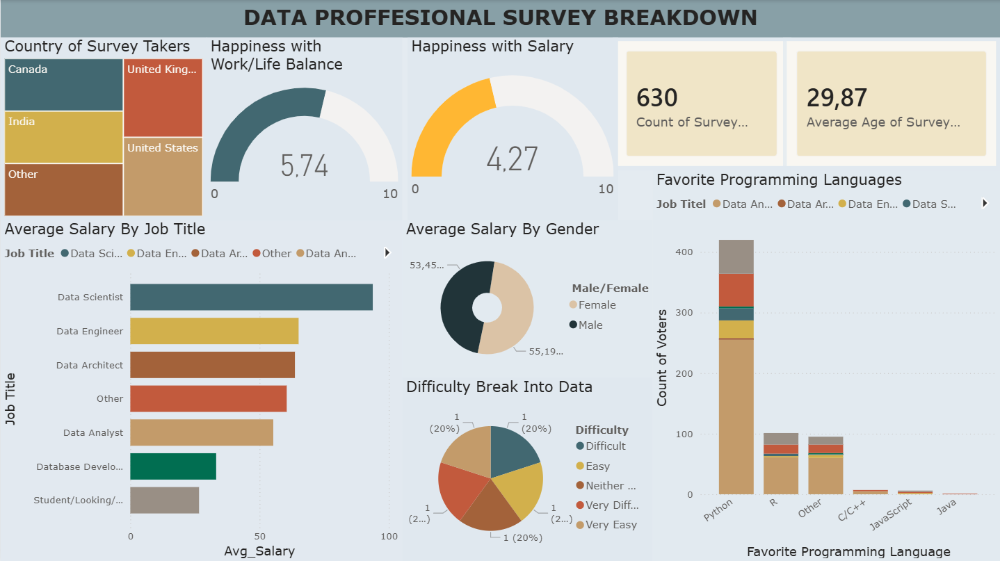

# Data Professional Survey Dashboard (Power BI)
## 📸 Dashboard Preview

This project is a Power BI dashboard built using real survey data collected from data professionals.

## 📊 Dashboard Overview
The dashboard analyzes:
- Average salary by job title
- Favorite programming languages
- Work-life balance & salary satisfaction
- Difficulty of breaking into data roles
- Country distribution of survey takers
- Gender-based salary comparison

## 🛠 Tools & Skills Used
- Power BI Desktop
- Power Query (data cleaning & transformation)
- DAX (basic measures & aggregations)
- Data visualization & dashboard design

## 📁 File
- `Data_Professional_Survey_Dashboard.pbix` – Power BI project file

## 🚀 Notes
This project was created as part of a Power BI learning series and demonstrates end-to-end workflow:
data cleaning → modeling → visualization → dashboard design.
